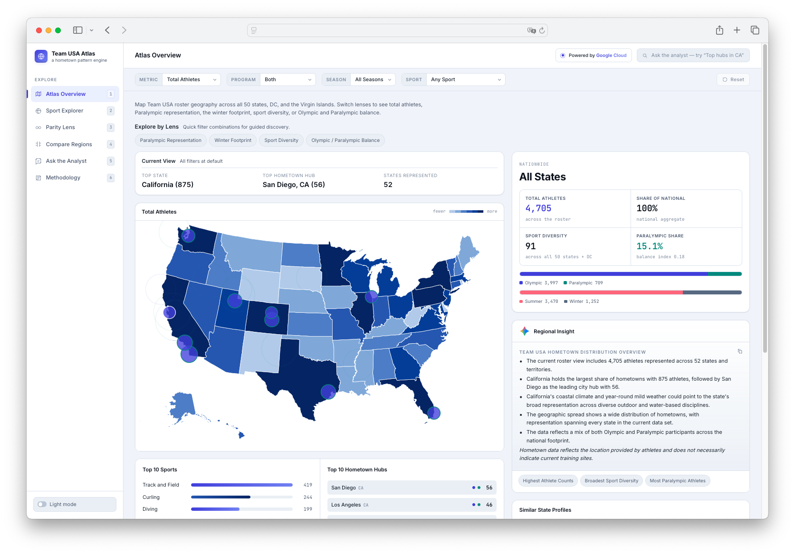

# Team USA Atlas

> **Pattern, not prediction — a fan-facing analyst dashboard for the hometown geography of Team USA, built on a constrained generation pipeline and deployed on Google Cloud.**

🔗 **Live demo:** **<https://team-usa-atlas-331498991819.us-central1.run.app>**
🎬 **Video walkthrough:** **<https://www.youtube.com/watch?v=1tQCAV8lZLM>**

Team USA Atlas turns ~5,000 Olympic and Paralympic athletes into an
interactive map of where Team USA actually comes from. Every state plus
DC and the Virgin Islands, summer and winter sports, Olympic and
Paralympic programs — surfaced through one consistent, equal-frame
view.



The product is built around two beliefs:

1. **Geography tells a story numbers alone don't.** Hometown patterns
   are a window into the communities, regions, and climates that are
   *associated with* Team USA representation today.
2. **Paralympic representation deserves the same surface as Olympic.**
   Both programs are first-class citizens on every page; *Parity Lens*
   is a top-level surface, not a sub-tab.

Atlas pairs a deterministic analytical core — every count, ranking, and
share percentage is computed in-browser from the cleaned roster — with
a guarded **Gemini 3** writing layer that turns those facts into the
plain-English context a fan would actually want. Five separate Gemini
surfaces, five distinct response contracts, one shared
defense-in-depth Responsible AI pipeline.

---

## What's Inside

| Page | What It Does |
|---|---|
| **Atlas Overview** | TopoJSON-based SVG choropleth across all 50 states + DC + VI, switchable across five "Explore by Lens" metrics (total roster, Paralympic representation, winter mix, sport diversity, Olympic↔Paralympic balance). Top-N hometown clusters render as a bubble overlay. |
| **Sport Explorer** | Pick a sport to see its national footprint, top hometown hubs, and a footprint-type classification (*Nationally Distributed / Regionally Clustered / Highly Concentrated*). |
| **Parity Lens** | Equal-frame Olympic vs. Paralympic representation across states, hubs, and sports — the surface that makes Paralympic patterns first-class. |
| **Compare Regions** | Side-by-side state profiles: counts, sport mix, season profile, hubs, climate context, plus a five-section AI-written *summary / at-a-glance / similarities / differences / most-distinct-contrast* readout. |
| **Ask the Analyst** | Conversational sourced-answer interface. A pre-call intent classifier routes free-text questions to a compact aggregate-facts payload; Gemini grounds every reply in those facts and politely declines anything off-roster. |
| **Methodology** | Full provenance, counting rules, AI behaviour, and Responsible AI guardrails — readable in-app, mirrored from this README. |

## The AI Layer

Gemini is integrated as a **constrained generation pipeline** sitting on
top of a deterministic analytical core. The model is never the source
of truth for a number; it is the *writing layer* that turns
schema-bounded aggregate facts into short, sourced, fan-friendly prose.

Every model-driven surface — the four insight cards plus Ask the
Analyst — flows through the same pipeline:

- **Per-surface JSON Schema contracts.** Each task (`atlas_insight`,
  `sport_insight`, `parity_insight`, `compare_insight`, `ask_answer`)
  binds to its own response schema with strict array-length bounds and
  per-field word caps. The Comparison surface alone uses a
  five-section narrative contract (`summaryBullets`, `atAGlance`,
  `similarities`, `differences`, `mostDistinctContrast`).
- **Structured outputs end-to-end.** Calls go through `@google/genai`
  with `responseMimeType: application/json`, an explicit
  `responseSchema` per task, `temperature: 0.2`, `topP: 0.8`, and
  `thinkingLevel: MINIMAL` — analyst-not-creative-writer behaviour
  with predictable latency.
- **Defense-in-depth validation.** Even though structured outputs
  enforce shape server-side, every response is re-validated locally:
  shape, array length, per-field word caps, and a banned-phrase scan
  for ranking, prediction, and causation language (`best`, `worst`,
  `champions`, `winners`, `medals`, `medalists`, `podium`, `causes`,
  `leads to`, `because of climate`, `talent factory`, etc.). Any
  failure flips the response to the deterministic fallback writer
  rather than leak unsafe phrasing to the page.
- **Pre-call intent classification + safety rephrase on Ask the
  Analyst.** Free-text questions are first classified into a
  controlled intent taxonomy and routed to the matching aggregate-fact
  builder. Identity-seeking, performance-seeking, or causal-claim
  prompts are rephrased toward what the roster geography can actually
  answer — and declined outright if they can't.
- **14-phrase conditional-language rotation pool.** The system
  instruction exposes a curated pool of non-causal verbs (*"could
  reflect," "may help explain why," "is consistent with," "lines up
  with," "tracks with," "could point to," "is in keeping with,"* …)
  and explicitly tells the model to vary the verb across bullets so
  the prose never reads like the same template twice.
- **Read-through context-cache memoisation.** Successful Gemini
  responses are memoised per stable view-fingerprint cache key for the
  rest of the session, so navigating away and back never burns a
  duplicate model call.
- **UI-indistinguishable deterministic fallback.** When the API key is
  missing, the network is offline, the schema check fails, or a banned
  phrase is detected, the deterministic local writer renders into the
  same component, with the same typography, the same word-by-word
  typewriter reveal, and the same *Evidence Used* citation block. The
  experience never breaks.

The Gemini API key lives server-side only; the browser only knows
about `POST /api/gemini/generate`. There are no regeneration loops — a
single failed call falls back, and the UI never spins twice.

> **Expect a short wait.** Insight cards and Ask the Analyst replies
> typically arrive in a few seconds, but Gemini occasionally takes
> 15–30 seconds — especially on **Compare Regions** (the richest
> schema) and the first Ask question after a cold start. The UI shows a
> shimmer + typing animation while the model is reading. The frontend
> aborts at 40 seconds; if the call truly stalls, the deterministic
> local insight takes over so the page never sits empty.

## Responsible AI

Responsible AI is enforced **in code, not just in the prompt**:

- **Conditional phrasing only.** Insights use *"could suggest,"
  *"may reflect,"* *"is consistent with,"* *"lines up with,"* *"could
  point to"* — never *"causes,"* *"produces,"* *"guarantees,"* or
  *"because of."* The 14-phrase rotation pool is a hard rule, not a
  suggestion.
- **Equal-frame Olympic + Paralympic.** Both programs share every
  surface; *Parity Lens* is dedicated to Paralympic representation.
- **No NIL, no individual outputs.** Athlete names, photos, ages,
  gender, medals, finish times, and per-event scores are stripped
  during ETL. Atlas only ever talks about aggregate hometown patterns.
- **Compact aggregate facts only.** Each request carries a small,
  schema-bounded JSON payload — never raw datasets, never individual
  rows.
- **Server-side key, schema-enforced output, banned-phrase scanned,
  no-regeneration policy.** Every response is validated before it
  reaches the page; failure flips to the fallback writer.
- **Evidence with every answer.** Each insight surfaces an
  *Evidence Used* block, locally authored from the same context payload
  the model saw. Citations are never written by the model itself.

The full Responsible AI section, including the allowed-vs.-avoided
language list and the scope guardrails, is available in-app on the
Methodology page.

## Deployment

Atlas is deployed to **Google Cloud Run** in `us-central1` as a
managed, scale-to-zero serverless service:

- **Runtime:** Node 20 + Express, autoscaling concurrency 80 per
  instance, request timeout 60 s (to leave headroom above the
  frontend's 40 s `AbortController` for the heavier compare schema).
- **Build:** containerised by Google Cloud Build directly from source
  on every deploy.
- **Secret hygiene:** `GEMINI_API_KEY` is injected as a Cloud Run
  service-config environment variable — encrypted at rest by Google,
  never bundled into the image, never sent to the browser.
- **Public access:** anonymous `roles/run.invoker`, served over
  Google-managed HTTPS at the run.app domain.

The full repo is also a one-command local boot for development (see
below).

## Tech Stack

- **AI Layer:** **Gemini 3 Flash-Lite** via `@google/genai` with
  per-task JSON Schemas, `responseMimeType: application/json`
  structured outputs, `thinkingLevel: MINIMAL`, `temperature: 0.2`,
  `topP: 0.8`. Defense-in-depth validation pipeline (server-side
  schema enforcement + client-side banned-phrase scan + UI-indistinguishable
  fallback).
- **Hosting:** **Google Cloud Run** (managed serverless), built from
  source by **Google Cloud Build**, traffic served via Google-managed
  HTTPS. Production URL is the canonical demo; local dev mirrors the
  exact same Express runtime.
- **Backend:** Node 20 + Express, two-layer response validation
  (`server/schemas.js` + `server/validate.js`), per-task structural
  checks, banned-phrase guardrail. API key loaded from `.env` via
  `dotenv` locally and from Cloud Run service config in production.
- **Frontend:** Vanilla ES modules, no build step, no framework
  runtime. Custom view router, hash-based navigation,
  `AbortController`-based 40 s timeout on every Gemini call,
  read-through context-cache memoisation keyed on stable view
  fingerprints, word-by-word typewriter reveal animation on every
  model-driven surface so Gemini and fallback prose feel identical.
- **Visualization:** TopoJSON basemap (us-atlas v3) rendered as inline
  SVG with a custom geo projection, custom horizontal-bar mini-charts,
  hometown bubble overlay precomputed against the same projection so
  bubbles align with state polygons.
- **Data ETL:** Offline Python pipeline in `scripts/` produces the
  cleaned aggregate files in `/data/`. Hometown coordinates derived
  from public-domain GeoNames; climate context from NOAA nClimDiv
  1991–2020 normals.

## Run It Locally

If you'd rather skip setup entirely, the live demo is the best
experience: **<https://team-usa-atlas-331498991819.us-central1.run.app>**
runs the exact same server in production. The steps below let you run
the same stack on your own machine.

### Prerequisites

- **Node 20 or newer.** Check with `node --version`. If you use
  [nvm](https://github.com/nvm-sh/nvm), run `nvm use` from the repo
  root — an `.nvmrc` is provided.
- **A Gemini API key.** Free tier is more than enough. Get one in
  about 30 seconds at <https://aistudio.google.com/apikey> — sign
  in with any Google account, click *Create API key*, copy the
  string (starts with `AIza…`).

### Step-by-step

```bash
# 1. Install dependencies
npm install

# 2. Create your local env file from the template
cp .env.example .env

# 3. Open .env in any editor and paste your key into GEMINI_API_KEY=
#    (leave GEMINI_MODEL and PORT at their defaults)

# 4. Start the server
npm run dev
```

Then open **<http://localhost:8000>** in any modern browser.

### What `.env` should look like

After step 3, your `.env` file should look like this (the key is
just an example — paste your own):

```bash
GEMINI_API_KEY=AIzaSyA-your-actual-key-here
GEMINI_MODEL=gemini-3.1-flash-lite
PORT=8000
```

`.env` is in `.gitignore`, so your key is never committed. The key
also stays server-side: it's only read by the Node process via
`process.env.GEMINI_API_KEY` and is never sent to the browser.

### Verify it's working

With the server running, open a second terminal and hit the health
endpoint:

```bash
curl http://localhost:8000/api/health
# Expected:
# {"ok":true,"hasKey":true,"model":"gemini-3.1-flash-lite"}
```

If `hasKey` is `true`, you're good — the four insight cards (Atlas,
Sport, Parity, Compare) and Ask the Analyst will all use Gemini.

### Common setup issues

| Symptom | Likely cause | Fix |
|---|---|---|
| `hasKey: false` in `/api/health` | `.env` missing or key not pasted | Re-check step 2–3; make sure there is no quote around the key and no trailing space |
| Insight cards always show local writeups | Same as above, or invalid key | Re-issue a key in AI Studio and paste it again |
| Port 8000 already in use | Another process on `:8000` | Change `PORT=8001` in `.env`, then open <http://localhost:8001> |
| `command not found: node` | Node not installed | Install Node 20+ from <https://nodejs.org/> |

### What `npm run dev` actually does

It boots an Express server in `server/` that hosts the static app on
port 8000, exposes the Gemini generation endpoint
(`POST /api/gemini/generate`) backed by `@google/genai`, and a
`/api/health` probe. The browser must use HTTP (not `file://`)
because the app `fetch()`es its data files at runtime.

Even **without** `GEMINI_API_KEY`, the server still boots and every
page stays fully functional — the AI surfaces just fall back to
their deterministic local insights so the dashboard is never
broken by a missing key.

## License

This project is licensed under the **Apache License, Version 2.0** —
see [`LICENSE`](./LICENSE) for the full text and [`NOTICE`](./NOTICE)
for third-party asset attributions.

Copyright 2026 Kim Fung
